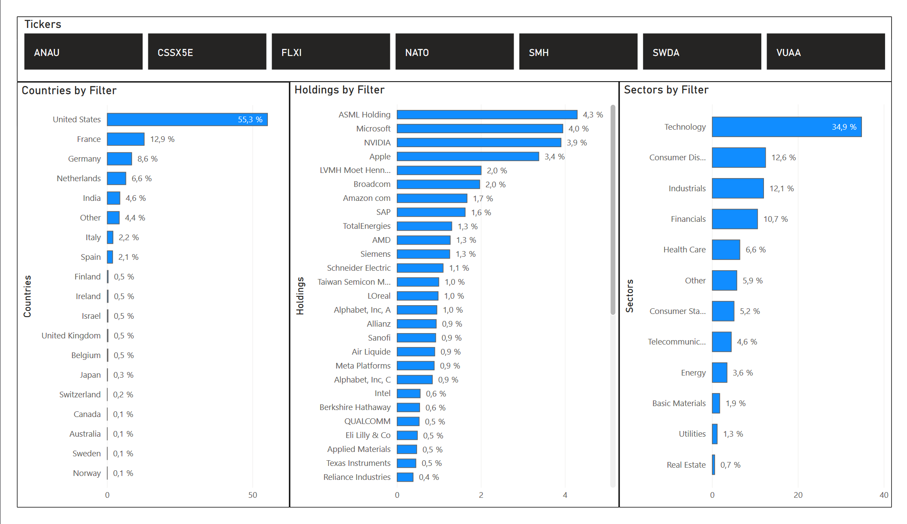

# Python-BusinessIntelligence-Scraper

## Description
Python-BusinessIntelligence-Scraper is designed to demonstrate how to integrate Python's scripting capabilities with business intelligence tools for effective data scraping and analysis. This project, serving as an example, focuses on extracting data from financial websites like JustETF.com and processing it through pandas in Jupyter notebooks to be visualized in Power BI. It aims to show analysts and investors how to derive visual insights into investment portfolios, enhancing decision-making processes.

## Features
- **Data Extraction**: Automated scraping of ETF information from JustETF.com.
- **Data Processing**: Utilization of pandas in Jupyter for efficient data handling and transformations.
- **Visualization**: Dynamic visualizations in Power BI to represent the scraped data effectively.
- **Educational Purpose**: Serves as a practical example for educational purposes on integrating Python with BI tools.

## Example Visualizations
Below are some example visualizations created in Power BI from the data scraped and processed by this tool:

Figure: A Power BI dashboard snapshot depicting portfolio allocation by country, top holdings, and sector weightings, each percentage weighted by ETF type.
  

Figure: A Power BI dashboard snapshot depicting portfolio allocation by country, top holdings, and sector weightings, each percentage weighted by ETF type. Used different filter.
  

Figure: Power BI dashboard detailing ETF prices, weighted portfolio values, and share distribution, with weighted volatility and total expense ratio metrics included.
  

Figure: Power BI dashboard detailing ETF prices, weighted portfolio values, and share distribution, with weighted volatility and total expense ratio metrics included. Used different filter.
  

## Note
The data and portfolio visualizations presented in this project are for demonstration purposes only and do not represent a real investment portfolio. They are intended to showcase the functionality of the Python-BusinessIntelligence-Scraper tool and its integration with Power BI for data visualization. Users should exercise caution and perform their own analysis before making any investment decisions based on the information provided by this project.